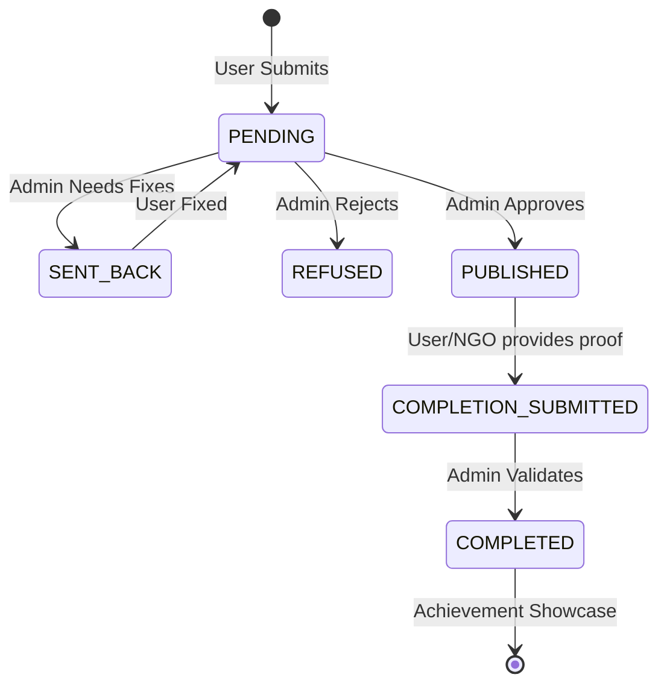

# 🧠 EcoSpot Ticket System Logic

Based on the **EcoSpot-Web** reference, the Ticket module follows a "Report-Review-Resolve" lifecycle involving different user personas.

## 👥 User Roles & Permissions

### 1. Regular User (The Reporter)
- **Submit Reports**: Post environmental issues (Title, Description, Location, Image).
- **Spam Check**: Their submissions are automatically scanned by AI.
- **Timeout**: If they spam >3 times in 24h, they are automatically banned for 24h.
- **Lifecycle**: Can only edit or delete tickets when they are `PENDING` or `SENT_BACK`.

### 2. Administrator (The Moderator & Validator)
- **Moderate Submissions**: Review pending tickets.
    - **Publish**: Makes the ticket visible to the public.
    - **Refuse**: Rejects the report (with notes).
    - **Send Back**: Asks the user to fix specifically named issues.
- **Validate Completion**: Review proof submitted by workers and mark tickets as `COMPLETED` (Achieved).

### 3. NGO & Public Users (The Workers)
- **Find Tasks**: Browse all `PUBLISHED` tickets on the public board.
- **Submit Proof**: Click "Complete", upload an image, and write a message as proof of resolution.
- **Showcase**: Once validated, their names appear in the **Achievements** hall of fame.

---

## 🔄 Ticket Status Workflow

## 🛠 Features to Implement in Java
- **Weather API Integration**: Fetch weekly forecast based on ticket coordinates (matches `OpenMeteoWeatherService`).
- **Notification System**: Status updates for users.
- **AI Spam Filter Mockup**: Implement the logic for spams and timeouts.
- **Administrative Review Panel**: Separate views for pending submissions vs completion proofs.
